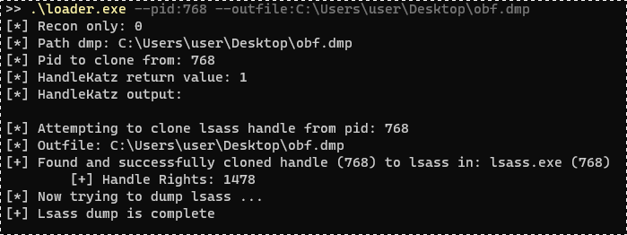

# HandleKatz

This tool was implemented as part of our Brucon2021 conference talk and demonstrates the usage of **cloned handles to Lsass** in order to create an obfuscated memory dump of the same.

It compiles down to an executable **living fully in its text segment**. Thus, the extracted .text segment of the PE file is fully position independent code (=PIC), meaning that it can be treated like any shellcode.

The execution of HandleKatz in memory has a very small footprint, as itself does not allocate any more executable memory and can therefore efficiently be combined with concepts such as (Phantom)DLL-Hollowing as described by [@_ForrestOrr](https://www.forrest-orr.net/post/malicious-memory-artifacts-part-i-dll-hollowing). This is in contrast to PIC PE loaders, such as Donut, SRDI or Reflective Loaders which, during PE loading, allocate more executable memory.
Additionally, it makes use of a modified version of ReactOS MiniDumpWriteDumpA and bypasses userlandhooks using [RecycledGate](https://github.com/thefLink/RecycledGate).     

For detailed information please refer to the PDF file **PICYourMalware.pdf** in this repository.

## Usage

- **make all** to build HandleKatzPIC.exe, HandleKatz.bin and loader.exe

**Please note** that different compiler (versions) yield different results. This might produce a PE file with relocations.

All tests were carried out using ```x86_64-w64-mingw32-gcc mingw-gcc version 11.2.0 (GCC)```. The produced PIC was successfully tested on: Windows 10 Pro 10.0.17763. On other versions of windows, API hashes might differ.

To use the PIC, cast a pointer to the shellcode in executable memory and call it according to the definition:
```
DWORD handleKatz(BOOL b_only_recon, char* ptr_output_path, uint32_t pid, char* ptr_buf_output);
```

- **b_only_recon** If set, HandleKatz will only enumerate suitable handles without dumping
- **ptr_output_path** Determines where the obfuscated dump will be written to
- **pid** What PID to clone a handle from
- **ptr_buf_output** A char pointer to which HandleKatz writes its internal output

For deobfuscation of the dump file, the script **Decoder.py** can be used.

**Loader** implements a sample loader for HandleKatz:
```
loader.exe --pid:7331 --outfile:C:\Temp\dump.obfuscated
```


## Detection

As cloned handles are used along with modified ReactOS code, no ProcessAccess events can be observed on Lsass. However, ProcessAccess events on programs which hold a handle to Lsass can be observed.

Defenders can monitor for ProcessAccess masks with set **PROCESS_DUP_HANDLE (0x0040)** to identify the usage of this tool.

## Credits

- Implementation by our [@thefLinkk](https://twitter.com/thefLinkk), see [C-To-Shellcode-Examples](https://github.com/thefLink/C-To-Shellcode-Examples) for more PIC examples.
- [@Hasherezade](https://twitter.com/hasherezade) for [tutorials](https://vxug.fakedoma.in/papers/VXUG/Exclusive/FromaCprojectthroughassemblytoshellcodeHasherezade.pdf) on the C-To-Shellcode concept
- [@ParanoidNinja](https://twitter.com/NinjaParanoid) for [tutorials](https://github.com/paranoidninja/PIC-Get-Privileges) on the C-To-Shellcode concept
- [@_ForrestOrr](https://twitter.com/_ForrestOrr) for his amazing [blogpost series](https://www.forrest-orr.net/post/malicious-memory-artifacts-part-i-dll-hollowing) on memory artifacts
- [@rookuu_](https://twitter.com/rookuu_) for the idea to use ReactOS MiniDumpWriteDump
- [Outflank](https://outflank.nl/) for documenting direct syscalls and their [InlineWhispers](https://github.com/outflanknl/InlineWhispers) project
- [React OS](https://reactos.org/) for the implementation of MiniDumpWriteDump
- [Hilko Bengen](https://github.com/hillu) for improving the makefile
